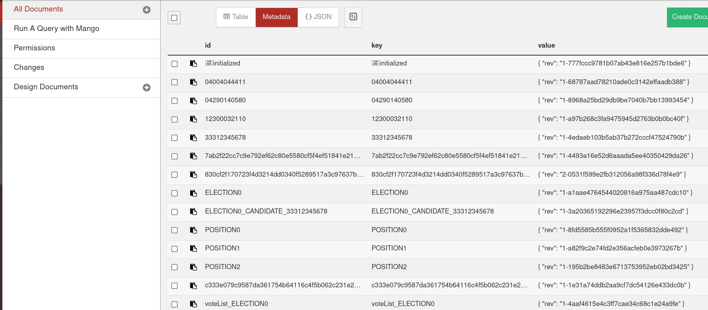
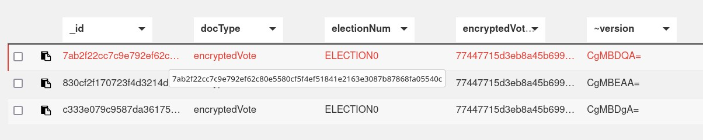
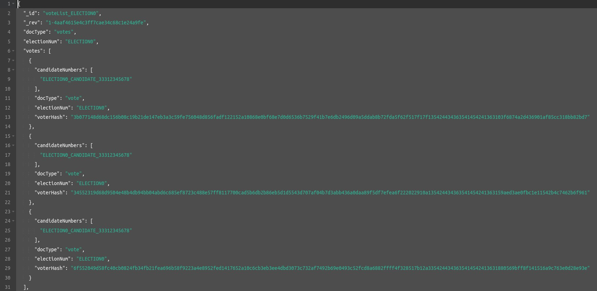

# Electoral Process - Chaincode spec

There is a **.env.example** in this folder. You should create a **.env** file basede in this example, and put the local information from the e-mail there.

## Assets

## Cryptography security

## Ledger

With the blockchain network running, if you access the the localhost in the port 5984, a client of the CouchDB could be found:
 - `http://127.0.0.1:5984/_utils/#/database/mychannel_electoral_process/_all_docs`

You can found every persisted data from every asset there:

