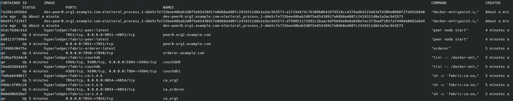
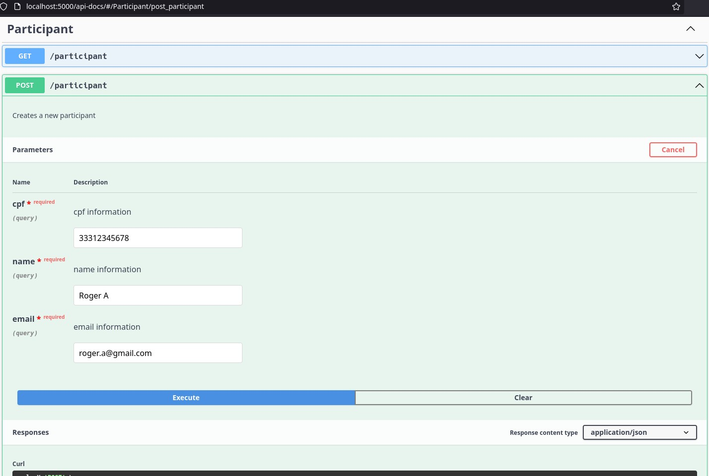
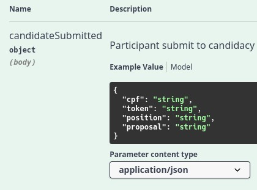
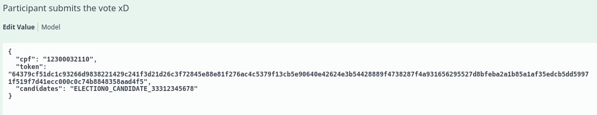
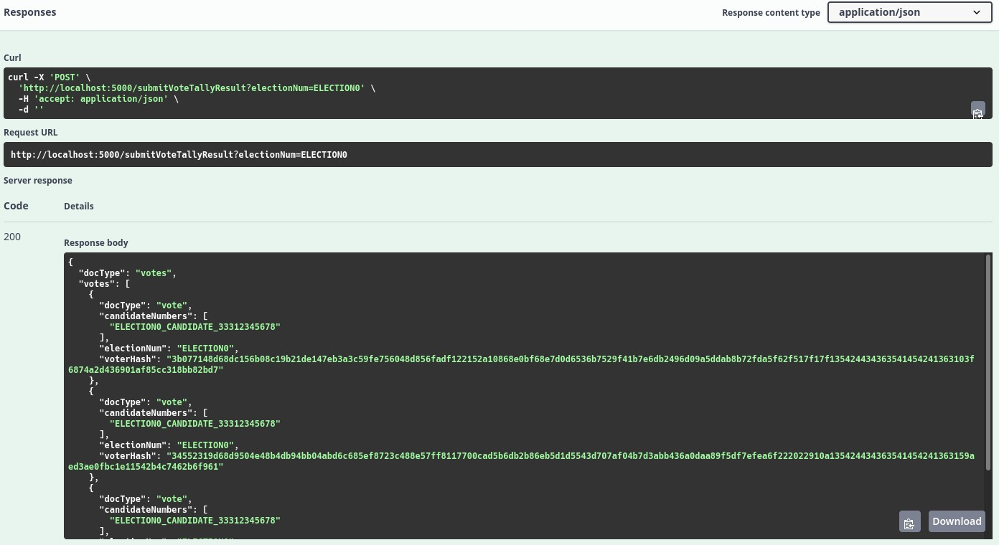
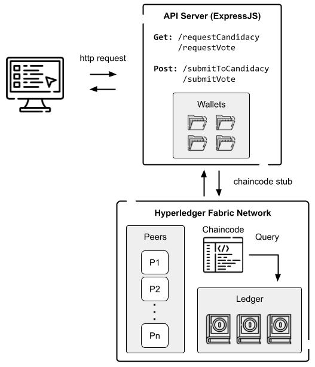

# Electoral Process - Blockchain Client / API Server  Tutorial

## Setup && Running
First, you must run the **npm i** to leave the packages up-to-date.
The use of this client require the chaincode to be running, along with all containers 
To do that, we can use the file `startNetwork.sh` with the parameter `typescript`
    
- `./startNetwork.sh typescript`

With the file `networkDown.sh` we can stop the containers and therefore, stop the blockchain network.

After the script finishes, if you see a success message and all the containers are good (`docker ps`), it means that the network was raised without errors.

Inside of the typescript folder, there are some `.sh` files that could help to follow the election process,
but the `enrollAdminUser.sh` is the only script that must be executed in order to enroll the first admin user.
It is needed to run `npm run build` every time that the code changed, or if this is the first time running.

For this prototype, the blockchain network starts with a election being created automatically by the chaincode.
There is a script to automatically create some positions inside of the election, then creates some participants and puts one of them as a candidate - `./simulateClient.sh`. This is optional. Those same steps will be showed inside the API.

There are some assets that will be present in the ledger:
 - Election
 - Position
 - Participant
 - Candidate
 - Vote
 - EncryptedVote
 - Votes
    
More details will be present in the [chaincode Readme](../chaincode/electoral_process/typescript)

## API
For now on, you can start the ExpressJS API with swagger documentation.

All endpoints related to a participant will deal with the CPF value. This is a unique register for a person, and the wallet within the blockchain network is also related to the same CPF value. This way the chaincode knows who is making the function calls. For the admin endpoints, the ID from the wallet is being hardcoded requested. It's not included in this project how the API should receive the informations or witch security approach will be used considering the differents users.

### **dotenv**

For this API to works fine, you should create a **.env** file based in the **.env.example**, present in this folder. Just copy and past and remove the word '.example' is enough, no need to change the value of the variables.

Still inside of the **fabric-samples/electoral_process/typescript/** folder, run the command:
 - `nodemon -L dist/server/electionServer`

Now you can open the url **http://localhost:5000/api-docs** and watch the changes in the terminal

## Participants
Following the election steps, you can create as many participants that you want.

## Candidacy
For the candidacy, you can try the requestCandidacy endpoint in the Swagger. For this to work, you should have created the **.env** file on the chaincode side, to be able to receive the e-mail that will be send to the participant registered e-mail. More info in the [chaincode Readme](../chaincode/electoral_process/typescript)

Then you can use the token info to submit the candidacy:

## Vote && Result
The same process happen with the vote. After the requestVote endpoint, a e-mail will be sent to the participant who requested it. One candidate ID for each position should be passed in a single string separated by comma (if there is more than one).

For the tally step, the ID of the election should be used as argument. The result is a list of votes decrypted from the encryptedVote, but still, don't exposing the voter. The difference is that now the vote has the information of the candidate, meaning that the result of the election can be rechecked. More technical details on that is being discussed in the chaincode Readme

This image explain the relation between the API and the blockchain network:

